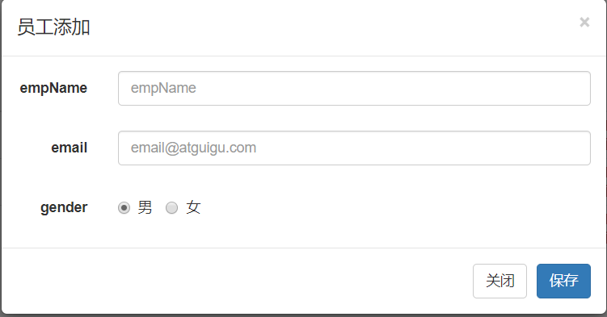

[TOC]

### Play-CRUD

#### 概述

这是一个用Scala语言完成的基础的Web后端CRUD项目，实现了员工管理的增删改查操作，用来掌握Scala后端项目的整体结构并熟悉响应的Web技术栈，巩固Scala语言基础。

#### 技术栈

语言：Scala

Web框架：Play for Scala

持久层框架：Slick

前端：BootStrap+jQuery

数据库：PostgreSQL

项目构建工具：SBT

#### 详述

该项目采用BootStrap快速搭建界面，全程采用jQuery的Ajax做CRUD的请求，路由配置为标准的RESTful配置，后端代码尽可能的简洁，因此采用案例类做实体，Slick使用FRM快速编写CRUD逻辑，因为逻辑较为简单，因此并没有引入Service层。

#### 后续优化和迭代计划

- 尝试Slick层用Plain SQL重构

- 尝试使用基于 「Scala 宏」的依赖注入框架[macwire](https://github.com/adamw/macwire) 管理注入，提高效率

- 尝试引入分页查询，批量删除等功能

- 加入后端和前端的验证，如邮箱验证，电话号码验证等

#### 效果图

